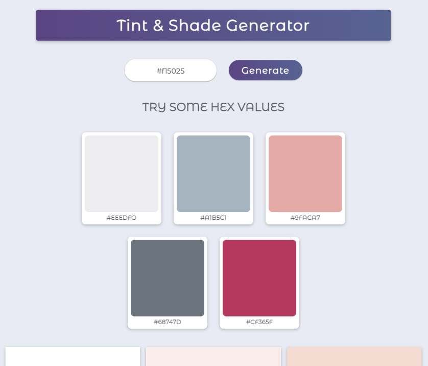

# Shades and Tints Generator

This repository contains the code for a React app that generates shades and tints of a given hex color using the `values.js` library. The app allows users to input a color and view various shades and tints of that color, helping with color selection and design choices.

## Live Demo

This is the live demo of the app. https://tints-and-shades-generator-pradeep.netlify.app/

## Features

- Generates shades and tints of a hex color.
- Allows users to input a color and view the resulting shades and tints.
- Provides a visual representation of the generated colors.
- Responsive design for seamless usage across different devices.

## Technologies Used

- HTML
- CSS
- React
- `values.js` library

## Getting Started

To run the React Shade and Tint Generator locally, follow these steps:

1. Clone the repository: `git clone https://github.com/pradeepkhanal23/Tints-and-Shades-Generator.git`
2. Navigate to the project directory: `cd Tints-and-Shades-Generator`
3. Install the dependencies: `npm install`
4. Start the development server: `npm start`

## Usage

1. Open the app in your browser.
2. Enter a hex color value in the input field.
3. Click the "Generate" button to generate shades and tints of the entered color.
4. The app will display the resulting colors in a visually appealing format.
5. Explore the shades and tints to assist with your color selection and design process.

## Customization

You can customize the behavior and appearance of the React Shade and Tint Generator app by modifying the code:

- Adjust the styles and layout in the CSS files to match your preferred design.
- Modify the logic in the React components to add new features or modify the color generation process.

## Contributing

Contributions to this project are welcome. To contribute, follow these steps:

1. Fork the repository.
2. Create a new branch: `git checkout -b my-feature-branch`
3. Make your changes and commit them: `git commit -m 'Add some feature'`
4. Push to the branch: `git push origin my-feature-branch`
5. Submit a pull request.

Please make sure to update tests as appropriate.

## License

This project is licensed under the [MIT License](LICENSE).

## Contact

If you have any questions or suggestions, feel free to reach out:

My info:

- Email:pradeepkhanal642@gmail.com
- GitHub: [pradeepkhanal23](https://github.com/pradeepkhanal23)
